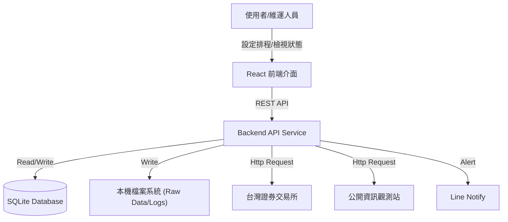
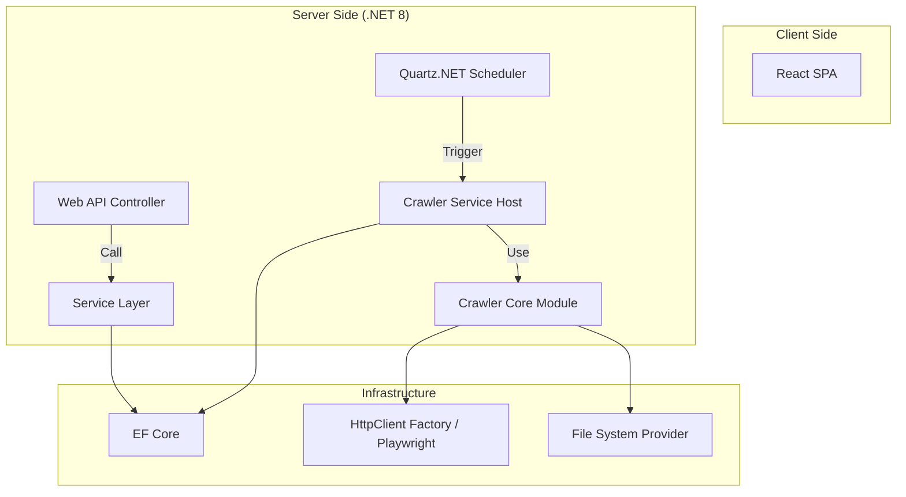
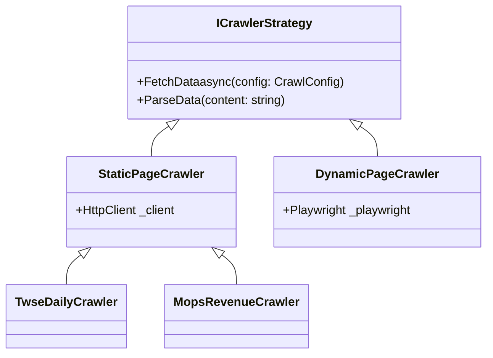
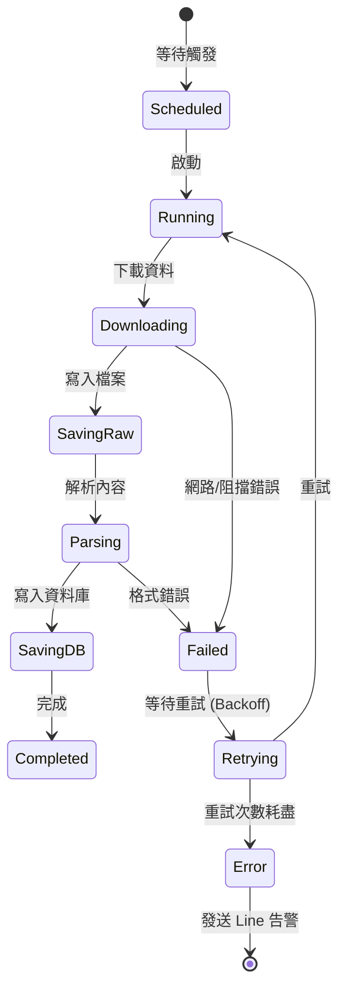

# 系統架構設計文件 (System Design Document)

## 1. 系統架構圖 (System Architecture)

### 1.1 系統上下文 (Context Diagram)



### 1.2 容器架構 (Container Diagram)



## 2. 核心模組設計

### 2.1 爬蟲模組 (Crawler Module)

*   **Strategy Pattern**：針對不同資料源 (TWSE, MOPS) 與頁面類型 (靜態, 動態) 實作不同策略。



### 2.2 排程與狀態機 (Scheduler & State Machine)

任務執行狀態流轉：



## 3. 資料庫設計 (Database Schema)

### 3.1 核心資料表

#### `StockSymbols` (股票代碼)
| Column | Type | Description |
|---|---|---|
| StockCode | PK, String | 股票代碼 (由排程更新) |
| Name | String | 股票名稱 |
| MarketType | Enum | 上市/上櫃/興櫃 |
| Industry | String | 產業類別 |
| IsActive | Boolean | 是否追蹤中 |

#### `DailyClosingQuotes` (每日收盤行情)
| Column | Type | Description |
|---|---|---|
| StockCode | PK, FK, String | 股票代碼 (Composite Key) |
| TradeDate | PK, DateTime | 交易日期 (Composite Key) |
| TradeVolume | Long | 成交股數 |
| TradeValue | Long | 成交金額 |
| OpeningPrice | Decimal | 開盤價 |
| HighestPrice | Decimal | 最高價 |
| LowestPrice | Decimal | 最低價 |
| ClosingPrice | Decimal | 收盤價 |
| Change | Decimal | 漲跌價差 |
| TransactionCount | Int | 成交筆數 |

#### `MonthlyRevenue` (月營收)
| Column | Type | Description |
|---|---|---|
| StockCode | PK, FK, String | 股票代碼 (Composite Key) |
| YearMonth | PK, String | 年月 (YYYYMM) (Composite Key) |
| RevenueCurrent | Decimal | 當月營收 |
| RevenueLastYear | Decimal | 去年同月營收 |
| MomChange | Decimal | 上月比較增減(%) |
| YoyChange | Decimal | 去年同月增減(%) |

#### `SystemConfigs` (設定檔)
以 Key-Value 形式儲存，或單一 JSON Column 儲存複雜設定。
- Key: `RetentionDays_RawData`, Value: `30`
- Key: `RetentionDays_Logs`, Value: `90`
- Key: `Schedule_TwseDaily`, Value: `{"Cron": "0 30 14 * * ?", "SuspendOnHoliday": true}`

#### `HolidayConfig` (JSON File)
儲存於應用程式根目錄 `config/holidays.json` (或 DB JSON 欄位)。
```json
{
  "2025": {
    "2025-01-01": { "Reason": "元旦", "IsHoliday": true },
    "2025-01-28": { "Reason": "農曆除夕", "IsHoliday": true }
  }
}
```

## 4. 目錄結構規劃 (Directory Structure)

```
/
├── .github/workflows/          # Github Actions (CI/CD)
├── docker-compose.yml          # Container Orchestration
├── src/
│   ├── SecuIntegrator26.API/       # Web API Entry Point
│   ├── SecuIntegrator26.Core/      # Domain Entities, Interfaces
│   ├── SecuIntegrator26.Infrastructure/ # EF Core, implementations
│   ├── SecuIntegrator26.Services/  # Business Logic, Crawler Logic
│   └── SecuIntegrator26.Client/    # React Frontend
└── test/
    └── SecuIntegrator26.Tests/     # xUnit Tests
```
